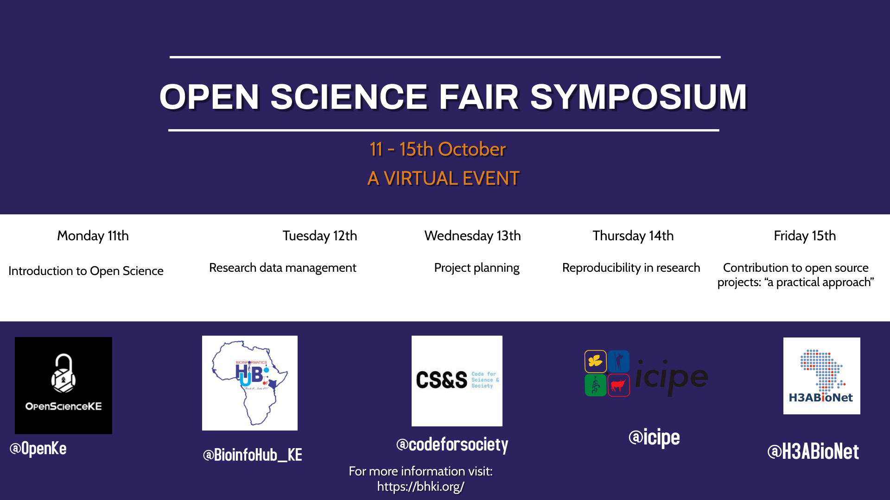

# Open Science FAIR Symposium

## Description
The event aims to sensitize the participants on FAIR open data science practices such as project planning and organization, collaboration, licensing, data sharing, among others, and expose them to use open science tools that facilitate these practices. 

## Objectives

## Program
Date | Time | Theme | Keynote Speaker(s)
---|---|---|---
11 October, 2021 | | Open science | Dr. Caleb Kibet   Dr. Jo Havemann    Mr. Johansen Obanda 
12 October, 2021 | 11:00 - 11:30AM | Research data management | Dr. Sara El-Gebali
13 October, 2021 | 11:00 - 11:30AM | Project planning | Ms. Joy Owango 
14 October, 2021 | 11:00 - 11:30AM  | Reproducibility in research | Dr. Malvika Sharan
15 October, 2021 | 11:00 - 12:00pm | Contribution to open source projects: “a practical approach” | Ms. Yo Yehudi   Dr. Nikoleta Glynatsi

## Registration for the open science FAIR symposium

